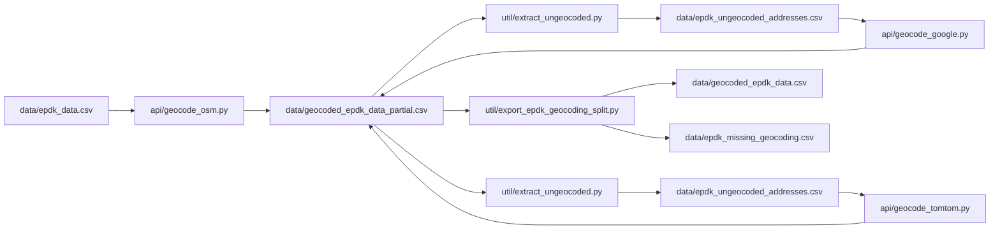

# EPDK geocoding

The pipeline turns raw EPDK socket rows in **`data/epdk_data.csv`** into coordinates by geocoding the **`Adres`** column.

For a shared Python environment (pandas, requests), see **[SETUP.md](SETUP.md)**. Several providers are used in sequence; the **partial CSV** under `data/` is the working master file, and **export** produces the two datasets you use for analysis.

## Layout (relevant paths)

- **`api/`** — `geocode_osm.py`, `geocode_google.py`, `geocode_tomtom.py`, `test_tomtom.py`
- **`util/`** — `extract_ungeocoded.py`, `export_epdk_geocoding_split.py`
- **`data/`** — all inputs, partial merge, checkpoints, and split outputs

API keys live in **`.env`** at the **repository root** (gitignored); geocoding scripts load it automatically.

## Current situation

- **Source of truth for “everything we have so far”:** `data/geocoded_epdk_data_partial.csv` — one row per socket, with `Latitude` / `Longitude` filled when known and empty where geocoding did not succeed (or was not run yet).
- **For everyday use:** run `python util/export_epdk_geocoding_split.py` from the repo root to refresh:
  - **`data/geocoded_epdk_data.csv`** — sockets with **both** coordinates.
  - **`data/epdk_missing_geocoding.csv`** — sockets **missing** at least one coordinate.
- **Checkpoints** (`data/geocoded_epdk_checkpoint.csv`, `data/geocoded_google_checkpoint.csv`, `data/geocoded_tomtom_checkpoint.csv`) were removed after the last consolidation. That is fine for using the current CSVs; if you **restart** `api/geocode_osm.py` from scratch, it will query Nominatim again for every unique address unless you restore a checkpoint backup.
- **Google Geocoding** was used as a second pass; the free quota often stopped the run **before** every remaining address was tried — so missing rows are not always “impossible” addresses, sometimes “not processed yet.”
- A **final Google pass** on leftovers is still possible later (see [Future: last Google pass](#future-last-google-pass)).

## End-to-end flow

1. **`api/geocode_osm.py`** — Nominatim (OpenStreetMap). Throttled (~1 req/s). Writes **`data/geocoded_epdk_checkpoint.csv`** (unique address cache) and **`data/geocoded_epdk_data_partial.csv`** (all sockets merged with coords or blanks).
2. **`util/extract_ungeocoded.py`** — Reads the partial file, writes **`data/epdk_ungeocoded_rows.csv`** and **`data/epdk_ungeocoded_addresses.csv`** (unique `Adres` only).
3. **`api/geocode_google.py`** — Fills what it can via Google Geocoding API; updates **`data/geocoded_google_checkpoint.csv`** and the partial file. Per-run call cap is configurable in the script.
4. **`api/geocode_tomtom.py`** — Same pattern for TomTom Search Geocode API; **`data/geocoded_tomtom_checkpoint.csv`** and partial.
5. **`util/export_epdk_geocoding_split.py`** — No pandas required. Splits partial → **`data/geocoded_epdk_data.csv`** + **`data/epdk_missing_geocoding.csv`**.

You do **not** need to rerun the whole chain for analysis: keep the partial updated when geocoding, then run the export.

## Scripts (quick reference)

Run from the **repository root**.

| Script | Depends on | Purpose |
|--------|------------|---------|
| `api/geocode_osm.py` | pandas, requests | Nominatim geocoding from `data/epdk_data.csv` |
| `util/extract_ungeocoded.py` | pandas | Build ungeocoded address lists from partial |
| `api/geocode_google.py` | pandas, requests | Google pass; needs `GOOGLE_MAPS_API_KEY` |
| `api/geocode_tomtom.py` | pandas, requests | TomTom pass; needs `TOMTOM_API_KEY` |
| `util/export_epdk_geocoding_split.py` | stdlib only | Split partial → geocoded + missing |

Constants at the top of each script (paths, `SAVE_EVERY`, sleep, API caps) can be adjusted without changing logic.

## Configuration

- **`.env`** (gitignored, repo root): place API keys there if you like. The Google and TomTom scripts load `GOOGLE_MAPS_API_KEY` and `TOMTOM_API_KEY` from the environment or from `.env` via a small built-in parser.
- **Nominatim** requires a valid **`User-Agent`** in `api/geocode_osm.py` (policy of the OSM usage policy).

## Future: last Google pass

1. Ensure **`data/geocoded_epdk_data_partial.csv`** is the file you merge new coordinates into (or run `api/geocode_google.py` again so it updates the partial — it reads the ungeocoded address list).
2. Run **`python util/extract_ungeocoded.py`** to recreate `data/epdk_ungeocoded_addresses.csv` from the current partial.
3. Run **`python api/geocode_google.py`** (with quota / key available).
4. Run **`python util/export_epdk_geocoding_split.py`** to refresh `data/geocoded_epdk_data.csv` and `data/epdk_missing_geocoding.csv`.

If you prefer not to use `util/extract_ungeocoded.py`, you can derive a unique-address CSV from **`data/epdk_missing_geocoding.csv`** (column `Adres`) and point `api/geocode_google.py` at that file by changing `UNIQUE_ADDRESSES_FILE` at the top of the script.

## Row counts

Row counts change whenever you geocode or export. After an export, the script prints how many rows went to each file; **geocoded + missing** should equal all data rows in the partial (excluding the header).
